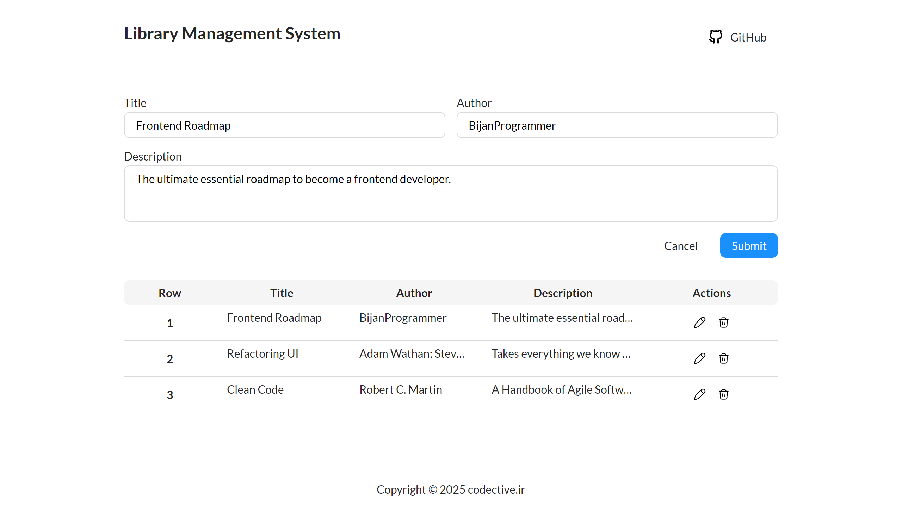

# Roadmap Quiz 1: 📚 Library Management System 📚

Welcome!
Consider that we're developing a web app for a library.
The client wants following features:

- View all books.
- Add a new book.
- Edit an existing book.
- Remove an existing book.

Since currently you don't have the knowledge to develop a JavaScript project for the web,
all the work regarding that matter has already done,
and you don't need to know worry about it.  
The only thing you need to do is to write the proper logic according to client's requested features.

## Goal

You'll start from a minimal initial project and must implement the full structure, styling, and logic exactly as specified below.
Your goal is to build the UI and logic so that all automated tests pass locally and in CI.

Use this guide carefully.
It tells you exactly what to build, where to put files, how to style things, and how to verify your solution.



## What You Get in the Initial Project

- `index.html` with a minimal skeleton and one example table row
- `assets/` containing fonts and icons
- `src/scripts/master.js` and `src/scripts/data.js`, plus a script link to `master.js` in `index.html`
- Test setup (Cypress + `package.json`) so you can run tests locally
- `.gitignore` (ignore it)
- `goal.png` which is a screenshot of the final UI

Everything else you must create yourself.

## How Your Submission Is Graded

- Automated Cypress tests run locally (`npm test`) and on GitHub pull requests.
- Tests verify:
  - HTML structure and semantics
  - CSS design tokens and usage, including computed visuals
  - JavaScript logic for listing, adding, editing, and removing books
  - Files/folders and asset paths
- The layout method (flex vs grid) doesn't matter. Visual outcome, naming, and structure do.

## Required Project Structure (Must Match Exactly)

```
.
├── index.html
├── assets/
│   ├── icons/
│   │   ├── edit.svg
│   │   ├── remove.svg
│   │   └── github.svg
│   └── fonts/
│       └── codective/
│           ├── regular.ttf
│           ├── italic.ttf
│           ├── bold.ttf
│           └── bold-italic.ttf
└── src/
    ├── scripts/
    │   ├── book.js
    │   ├── library-manager.js
    │   ├── data.js
    │   └── master.js
    └── styles/
        ├── globals.css
        ├── shared/
        │   ├── colors.css
        │   ├── fonts.css
        │   └── shapes.css
        └── components/
            ├── button.css
            ├── link-button.css
            ├── icon-button.css
            ├── header.css
            ├── form.css
            ├── table.css
            └── footer.css
```

Do not rename or move these files.

## Notes

### Paths

All paths have to be absolute with leading slash.  
For example these are correct:

- ✅ `/assets/fonts/codective/regular.ttf`
- ✅ `/src/styles/components/link-button.css`

And these are incorrect:

- ❌ `assets/fonts/codective/regular.ttf`
- ❌ `./src/styles/components/link-button.css`

### CSS Variables

You should use css variables with exact name and value that is mentioned in this document.  
Do not use any color directly; Use a variable instead.  
This also applies for the `border-raduis`;

### CSS Values

You should only use `hsl` for colors.  
Also pay attention to units mentioned in this document and use them exactly as is.  
Do not convert `rem` to `px` and do not use `font-size: 62.5%` trick.

## HTML Requirements

- [ ] DOCTYPE present
- [ ] `html` with correct `lang`
- [ ] `meta` with `charset` of `UTF-8`
- [ ] `title` with `Library Management System` as text
- [ ] Link all stylesheets separately
- [ ] Link only `master.js` with `type` of `module`
- [ ] Header includes:
  - [ ] `h1` with `class` of `logo` and `Library Management System` as text
  - [ ] `a` with `class` of `link-button` and href of your own GitHub profile page (ie: `https://github.com/BijanProgrammer`)
    - [ ] Contains `img` with `class` of `icon`, proper `src`, and blank `alt`
    - [ ] Contains `GitHub` as text (no `span` required)
- [ ] Form includes:
  - [ ] Title
    - [ ] `label` with `for` of `title`
    - [ ] `input` with `id` of `title`, `name` of `title`, and `required`
  - [ ] Author
    - [ ] `label` with `for` of `author`
    - [ ] `input` with `id` of `author`, `name` of `author`, `autocomplete` of `name`, and `required`
  - [ ] Description
    - [ ] `label` with `for` of `description`
    - [ ] `textarea` with `id` of `description`, `name` of `description`, `minlength` of `3`, and `required`
  - [ ] Actions which is a `div` with `class` of `actions` containing:
    - [ ] Reset `button` with `class` of `button` and `Cancel` as text
    - [ ] Cancel `button` with `class` of `button` and `Submit` as text
- [ ] Table includes:
  - [ ] `thead` with headers in order: `Row`, `Title`, `Author`, `Description`, `Actions`
  - [ ] `tbody` tag populated by JavaScript
  - [ ] In `tbody`, the first cell of each row is a `th` tag showing the 1-based row number
  - [ ] In `tbody`, `td` tags for Title/Author/Description have `title` attribute equal to the cell text (Do not set `title` on the Actions cell)
- [ ] `footer` contains the text `codective.ir`

## CSS Requirements

### Design tokens

define these in `:root` in `colors.css`:

| Variable          | Value                 |
| ----------------- | --------------------- |
| `--color-gray-1`  | `hsl(0, 0%, 100%)`    |
| `--color-gray-3`  | `hsl(0, 0%, 96%)`     |
| `--color-gray-5`  | `hsl(0, 0%, 85%)`     |
| `--color-gray-10` | `hsl(0, 0%, 15%)`     |
| `--color-blue-1`  | `hsl(199, 100%, 95%)` |
| `--color-blue-6`  | `hsl(209, 100%, 55%)` |
| `--color-blue-7`  | `hsl(211, 92%, 44%)`  |
| `--color-red-6`   | `hsl(357, 91%, 55%)`  |

### Shapes

define these in `:root` in `shapes.css`:

| Variable          | Value    |
| ----------------- | -------- |
| `--border-radius` | `0.5rem` |

### Fonts

define these in `fonts.css`:

| `font-style` | `font-weight` | `src`             |
| ------------ | ------------- | ----------------- |
| `normal`     | `400`         | `regular.ttf`     |
| `italic`     | `400`         | `italic.ttf`      |
| `normal`     | `700`         | `bold.ttf`        |
| `italic`     | `700`         | `bold-italic.ttf` |

Declare 4 `@font-face` rules that map to the assets above.  
Use `Codective` as `font-family` for all of them.

Also set the global font on the root: add a rule so `html` uses `font-family: Codective, sans-serif`.

### Usage rules

In component styles (`globals.css`, `components/*.css`):

- [ ] For `color`, `background-color`, `border-color`, `outline-color` use only `var(--...)`
- [ ] Body `max-inline-size` is `60rem` and it has non-zero horizontal padding
- [ ] Do not use raw color values in declarations (no hex, rgb, hsl)
- [ ] Allowed keywords: `transparent`, `currentColor`, `inherit`, `initial`, `unset`

Computed visual outcomes:

- [ ] Body `background-color` is `--color-gray-1` and its `color` is `--color-gray-10`
- [ ] Header logo `font-size` is `1.5rem` and `font-weight` is `700`
- [ ] Form actions (`.actions`) have a positive `gap` between children
- [ ] Table header `background-color` is `--color-gray-3`

## JavaScript Requirements

You are given `master.js` (renders UI, wires events) and `data.js` (provides `initialBooks`).  
You must implement the following modules with the exact names and behaviors.  
Do not paste large code from elsewhere - write these yourself.

### book.js

- [ ] Class: `Book`
- [ ] Public fields: `title`, `author`, `description`
- [ ] Constructor accepts `(title, author, description)` and assigns to fields
- [ ] Instance method: `clone()` returns a new `Book` with the same field values

### library-manager.js

- [ ] Class: `LibraryManager`
- [ ] Private field: `#books`
- [ ] Constructor accepts an array of `Book` and stores a cloned copy (not the same references)
- [ ] Getter: `books` returns the internal array
- [ ] Method: `addBook(book)` appends a book
- [ ] Method: `editBook(row, book)` replaces the book at 1-based index `row`
- [ ] Method: `removeBook(row)` removes the book at 1-based index `row`
- [ ] Method: `clone()` returns a deep copy (new `LibraryManager` with cloned books)

### Logic

- [ ] On load, the table shows the 3 books from `initialBooks`
- [ ] Submitting the form adds a new row with the provided title/author/description
- [ ] Clicking a row's first action (Edit) loads that row into the form; submitting saves the changes back to the table
- [ ] Clicking a row's second action (Remove) deletes the row and the first column reindexes starting at `1`
- [ ] Row actions use these icons and `alt`:
  - [ ] Edit: `edit.svg"` and `alt="Edit Icon"`
  - [ ] Remove: `remove.svg"` and `alt="Remove Icon"`

## How To Run and Test Locally

- [ ] Install dependencies: `npm install`
- [ ] Run tests (headless): `npm test`
- [ ] Optional: open the runner UI: `npx cypress open`

The tests will start a local server and run end-to-end checks automatically.

## CI on GitHub (Automatic)

- When you open a pull request, GitHub Actions run the same Cypress tests automatically.
- Ensure your branch includes all required files and exact paths so CI can fetch them.

## Submission Tips

- Keep naming consistent with this guide
- Use Prettier to keep formatting clean
- Run tests locally before pushing
- Once everything is green, open a PR to trigger CI

Good luck! You've got this 🚀
